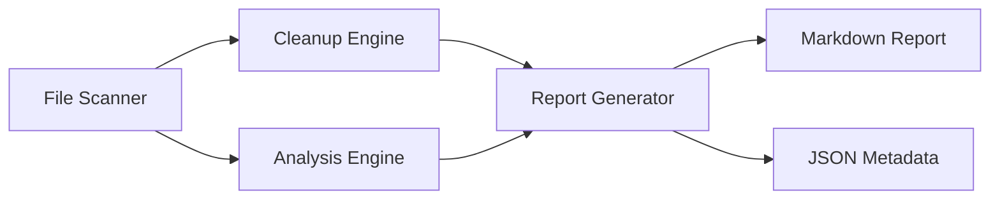

# Design Document

## Overview

The Project Cleanup and Optimization feature is a comprehensive static analysis and auditing system designed to identify technical debt, unused files, and optimization opportunities within the ISP-FinTrack codebase. This feature operates as a standalone analysis tool that scans the project structure, evaluates code quality, performance, security, and generates actionable recommendations.

### Design Goals

1. **Automated Discovery**: Identify unused files, technical debt, and improvement areas without manual inspection
2. **Actionable Insights**: Provide specific, implementable recommendations with clear impact estimates
3. **Risk Assessment**: Categorize findings by priority and impact to enable informed decision-making
4. **Production Safety**: Ensure recommendations maintain or improve the current Real Experience Score of 99
5. **Maintainability**: Create a reusable analysis framework that can be run periodically

### Key Constraints

- Must not modify any production code during analysis
- Must complete analysis within reasonable time (< 5 minutes for full scan)
- Must generate human-readable reports in Markdown format
- Must respect exclusions (node_modules, .next, .git, binary files)
- Must maintain backward compatibility with existing codebase

## Architecture

### System Components

The system follows a pipeline architecture with three main stages:



### Component Responsibilities

#### 1. File Scanner
- Traverses project directory structure
- Builds file inventory with metadata (size, type, last modified)
- Applies exclusion rules
- Generates dependency graph from import statements

#### 2. Cleanup Engine
- Identifies unused files based on reference analysis
- Categorizes files by type (debug, backup, log, script, artifact)
- Calculates space savings potential
- Validates safe-to-delete status

#### 3. Analysis Engine
- Performs multi-dimensional code analysis:
  - Structure Analysis: Directory organization, code duplication
  - UI/UX Analysis: Component consistency, accessibility, responsiveness
  - Performance Analysis: Bundle size, lazy loading, database queries
  - Code Quality Analysis: Type safety, error handling, complexity
  - Security Analysis: Vulnerability scanning, credential exposure
  - Database Analysis: Schema optimization, query performance
  - Best Practices: Framework patterns, conventions

#### 4. Report Generator
- Aggregates findings from all analyzers
- Prioritizes recommendations by impact and effort
- Groups improvements into phases (Quick Wins, Short Term, Long Term)
- Generates structured Markdown output with actionable items

## Components and Interfaces

### Core Types

```typescript
// File metadata and classification
interface FileMetadata {
  path: string;
  size: number;
  type: FileType;
  lastModified: Date;
  isReferenced: boolean;
  referencedBy: string[];
}

enum FileType {
  SOURCE = 'source',
  DEBUG = 'debug',
  BACKUP = 'backup',
  LOG = 'log',
  SCRIPT = 'script',
  ARTIFACT = 'artifact',
  CONFIG = 'config',
  DOCUMENTATION = 'documentation',
  ASSET = 'asset'
}

// Analysis findings
interface Finding {
  id: string;
  category: FindingCategory;
  severity: Severity;
  title: string;
  description: string;
  location: string;
  impact: ImpactEstimate;
  effort: EffortEstimate;
  recommendation: Recommendation;
}

enum FindingCategory {
  FILE_CLEANUP = 'file_cleanup',
  STRUCTURE = 'structure',
  UI_UX = 'ui_ux',
  PERFORMANCE = 'performance',
  CODE_QUALITY = 'code_quality',
  SECURITY = 'security',
  DATABASE = 'database',
  BEST_PRACTICES = 'best_practices'
}

enum Severity {
  CRITICAL = 'critical',
  HIGH = 'high',
  MEDIUM = 'medium',
  LOW = 'low'
}

interface ImpactEstimate {
  score: number; // 1-10
  description: string;
  metrics?: {
    performanceGain?: string; // e.g., "50ms reduction"
    spaceSaving?: string; // e.g., "2.5MB"
    maintainabilityImprovement?: string;
  };
}

interface EffortEstimate {
  hours: number;
  complexity: 'trivial' | 'simple' | 'moderate' | 'complex';
}

interface Recommendation {
  action: string;
  steps: string[];
  codeExample?: {
    before: string;
    after: string;
  };
  commands?: string[];
  testingStrategy: string;
  rollbackPlan: string;
  successCriteria: string[];
  dependencies?: string[]; // IDs of prerequisite findings
}

// Report structure
interface AnalysisReport {
  metadata: ReportMetadata;
  summary: ReportSummary;
  filesToDelete: FileCleanupSection;
  findings: Finding[];
  implementationPlan: ImplementationPlan;
}

interface ReportMetadata {
  generatedAt: Date;
  projectPath: string;
  analysisVersion: string;
  scanDuration: number; // milliseconds
}

interface ReportSummary {
  totalFilesScanned: number;
  totalFilesToDelete: number;
  totalSpaceSavings: string;
  totalFindings: number;
  findingsBySeverity: Record<Severity, number>;
  findingsByCategory: Record<FindingCategory, number>;
  estimatedTotalImpact: number;
  estimatedTotalEffort: number;
}

interface FileCleanupSection {
  files: FileMetadata[];
  totalSize: number;
  categorization: Record<FileType, FileMetadata[]>;
}

interface ImplementationPlan {
  quickWins: Finding[]; // < 2 hours, high impact
  shortTerm: Finding[]; // 2-8 hours
  longTerm: Finding[]; // > 8 hours
  phases: Phase[];
}

interface Phase {
  name: string;
  description: string;
  findings: string[]; // Finding IDs
  estimatedDuration: string;
  prerequisites: string[];
}
```

### File Scanner Interface

```typescript
interface IFileScanner {
  /**
   * Scans the project directory and builds file inventory
   */
  scan(rootPath: string, exclusions: string[]): Promise<FileMetadata[]>;
  
  /**
   * Builds dependency graph from import statements
   */
  buildDependencyGraph(files: FileMetadata[]): Promise<DependencyGraph>;
  
  /**
   * Identifies unreferenced files
   */
  findUnreferencedFiles(
    files: FileMetadata[], 
    graph: DependencyGraph
  ): FileMetadata[];
}

interface DependencyGraph {
  nodes: Map<string, FileNode>;
  edges: Map<string, string[]>; // file -> dependencies
}

interface FileNode {
  path: string;
  imports: string[];
  importedBy: string[];
}
```

### Cleanup Engine Interface

```typescript
interface ICleanupEngine {
  /**
   * Analyzes files and identifies candidates for deletion
   */
  analyzeFiles(files: FileMetadata[]): Promise<FileCleanupSection>;
  
  /**
   * Categorizes files by type
   */
  categorizeFile(file: FileMetadata): FileType;
  
  /**
   * Determines if file is safe to delete
   */
  isSafeToDelete(file: FileMetadata, graph: DependencyGraph): boolean;
  
  /**
   * Generates deletion rationale
   */
  generateRationale(file: FileMetadata): string;
}
```

### Analysis Engine Interface

```typescript
interface IAnalysisEngine {
  /**
   * Runs all analyzers and aggregates findings
   */
  analyze(context: AnalysisContext): Promise<Finding[]>;
  
  /**
   * Registers custom analyzers
   */
  registerAnalyzer(analyzer: IAnalyzer): void;
}

interface AnalysisContext {
  files: FileMetadata[];
  dependencyGraph: DependencyGraph;
  projectRoot: string;
  packageJson: any;
  tsConfig: any;
}

interface IAnalyzer {
  name: string;
  category: FindingCategory;
  
  /**
   * Performs specific analysis
   */
  analyze(context: AnalysisContext): Promise<Finding[]>;
}
```

### Specific Analyzers

```typescript
// Structure Analyzer
interface IStructureAnalyzer extends IAnalyzer {
  detectDuplication(files: FileMetadata[]): Promise<Finding[]>;
  analyzeDirectoryStructure(files: FileMetadata[]): Promise<Finding[]>;
  findCircularDependencies(graph: DependencyGraph): Promise<Finding[]>;
  identifyUnusedDependencies(packageJson: any, files: FileMetadata[]): Promise<Finding[]>;
}

// UI/UX Analyzer
interface IUIUXAnalyzer extends IAnalyzer {
  checkDesignSystemConsistency(components: FileMetadata[]): Promise<Finding[]>;
  analyzeAccessibility(components: FileMetadata[]): Promise<Finding[]>;
  checkResponsiveness(components: FileMetadata[]): Promise<Finding[]>;
  detectCLSIssues(components: FileMetadata[]): Promise<Finding[]>;
}

// Performance Analyzer
interface IPerformanceAnalyzer extends IAnalyzer {
  analyzeBundleSize(files: FileMetadata[]): Promise<Finding[]>;
  checkLazyLoading(components: FileMetadata[]): Promise<Finding[]>;
  analyzeDatabaseQueries(actions: FileMetadata[]): Promise<Finding[]>;
  checkImageOptimization(assets: FileMetadata[]): Promise<Finding[]>;
}

// Code Quality Analyzer
interface ICodeQualityAnalyzer extends IAnalyzer {
  checkTypeScript(files: FileMetadata[]): Promise<Finding[]>;
  analyzeErrorHandling(files: FileMetadata[]): Promise<Finding[]>;
  detectConsoleStatements(files: FileMetadata[]): Promise<Finding[]>;
  analyzeComplexity(files: FileMetadata[]): Promise<Finding[]>;
}

// Security Analyzer
interface ISecurityAnalyzer extends IAnalyzer {
  scanForCredentials(files: FileMetadata[]): Promise<Finding[]>;
  checkSQLInjection(files: FileMetadata[]): Promise<Finding[]>;
  checkXSS(files: FileMetadata[]): Promise<Finding[]>;
  validateEnvironmentVariables(files: FileMetadata[]): Promise<Finding[]>;
}

// Database Analyzer
interface IDatabaseAnalyzer extends IAnalyzer {
  analyzeMissingIndexes(schemaFiles: FileMetadata[]): Promise<Finding[]>;
  checkForeignKeys(schemaFiles: FileMetadata[]): Promise<Finding[]>;
  analyzeDataTypes(schemaFiles: FileMetadata[]): Promise<Finding[]>;
  detectNPlusOne(actions: FileMetadata[]): Promise<Finding[]>;
}

// Best Practices Analyzer
interface IBestPracticesAnalyzer extends IAnalyzer {
  validateNextJSPatterns(files: FileMetadata[]): Promise<Finding[]>;
  validateReactHooks(components: FileMetadata[]): Promise<Finding[]>;
  checkCachingStrategies(actions: FileMetadata[]): Promise<Finding[]>;
}
```

### Report Generator Interface

```typescript
interface IReportGenerator {
  /**
   * Generates comprehensive analysis report
   */
  generate(
    cleanup: FileCleanupSection,
    findings: Finding[]
  ): Promise<AnalysisReport>;
  
  /**
   * Exports report to Markdown
   */
  exportMarkdown(report: AnalysisReport): string;
  
  /**
   * Exports metadata to JSON
   */
  exportJSON(report: AnalysisReport): string;
  
  /**
   * Prioritizes findings
   */
  prioritize(findings: Finding[]): Finding[];
  
  /**
   * Groups findings into implementation phases
   */
  createImplementationPlan(findings: Finding[]): ImplementationPlan;
}
```

## Data Models

### File System Model

The system maintains an in-memory representation of the project structure:

```typescript
class ProjectStructure {
  private files: Map<string, FileMetadata>;
  private dependencyGraph: DependencyGraph;
  
  constructor(rootPath: string) {
    this.files = new Map();
    this.dependencyGraph = { nodes: new Map(), edges: new Map() };
  }
  
  addFile(file: FileMetadata): void;
  getFile(path: string): FileMetadata | undefined;
  getAllFiles(): FileMetadata[];
  getFilesByType(type: FileType): FileMetadata[];
  getDependencies(path: string): string[];
  getDependents(path: string): string[];
}
```

### Analysis State Model

```typescript
class AnalysisState {
  private findings: Map<string, Finding>;
  private progress: AnalysisProgress;
  
  addFinding(finding: Finding): void;
  getFindings(): Finding[];
  getFindingsByCategory(category: FindingCategory): Finding[];
  getFindingsBySeverity(severity: Severity): Finding[];
  updateProgress(analyzer: string, status: string): void;
}

interface AnalysisProgress {
  totalAnalyzers: number;
  completedAnalyzers: number;
  currentAnalyzer: string;
  startTime: Date;
  estimatedCompletion: Date;
}
```

## Error Handling

### Error Categories

1. **File System Errors**: Permission denied, file not found, path too long
2. **Parse Errors**: Invalid TypeScript/JSON, malformed imports
3. **Analysis Errors**: Analyzer crashes, timeout, memory issues
4. **Report Generation Errors**: Template errors, file write failures

### Error Handling Strategy

```typescript
class AnalysisError extends Error {
  constructor(
    message: string,
    public category: ErrorCategory,
    public severity: ErrorSeverity,
    public context?: any
  ) {
    super(message);
  }
}

enum ErrorCategory {
  FILE_SYSTEM = 'file_system',
  PARSE = 'parse',
  ANALYSIS = 'analysis',
  REPORT = 'report'
}

enum ErrorSeverity {
  FATAL = 'fatal', // Stop analysis
  ERROR = 'error', // Skip item, continue
  WARNING = 'warning' // Log, continue
}

// Error handling in analyzers
async function safeAnalyze(
  analyzer: IAnalyzer,
  context: AnalysisContext
): Promise<Finding[]> {
  try {
    return await analyzer.analyze(context);
  } catch (error) {
    console.error(`Analyzer ${analyzer.name} failed:`, error);
    
    // Log error as a finding
    return [{
      id: `error-${analyzer.name}`,
      category: FindingCategory.CODE_QUALITY,
      severity: Severity.LOW,
      title: `Analysis Error: ${analyzer.name}`,
      description: `Analyzer failed: ${error.message}`,
      location: 'N/A',
      impact: { score: 0, description: 'Analysis incomplete' },
      effort: { hours: 0, complexity: 'trivial' },
      recommendation: {
        action: 'Investigate analyzer failure',
        steps: ['Check logs', 'Review analyzer implementation'],
        testingStrategy: 'N/A',
        rollbackPlan: 'N/A',
        successCriteria: ['Analyzer runs successfully']
      }
    }];
  }
}
```

### Graceful Degradation

- If a specific analyzer fails, continue with remaining analyzers
- If file parsing fails, skip file and log warning
- If dependency graph is incomplete, mark as partial analysis
- Always generate report even with partial data

## Testing Strategy

### Testing Approach

This feature is a **static analysis and code auditing tool** that performs file system operations, code parsing, and report generation. Property-based testing is **NOT appropriate** for this feature because:

1. **Not testing pure functions**: The system performs I/O operations (file reading, directory traversal)
2. **Deterministic external behavior**: File system operations don't vary meaningfully with input in a way that benefits from randomization
3. **Configuration and analysis**: The feature validates project structure and generates reports, which are better tested with concrete examples

**Testing Strategy**: Use **example-based unit tests** and **integration tests** with representative project structures.

### Unit Testing

**Focus Areas**:
- File categorization logic (debug vs backup vs log files)
- Severity calculation algorithms
- Impact score computation
- Effort estimation logic
- Recommendation generation
- Report formatting

**Example Tests**:
```typescript
describe('CleanupEngine', () => {
  it('should categorize .log files as LOG type', () => {
    const file = { path: 'debug/output.log', size: 1024 };
    expect(categorizeFile(file)).toBe(FileType.LOG);
  });
  
  it('should mark unreferenced .js files in scratch/ as safe to delete', () => {
    const file = { path: 'scratch/test.js', isReferenced: false };
    expect(isSafeToDelete(file)).toBe(true);
  });
  
  it('should calculate correct space savings', () => {
    const files = [
      { size: 1024 * 1024 }, // 1MB
      { size: 512 * 1024 }   // 512KB
    ];
    expect(calculateSpaceSavings(files)).toBe('1.50 MB');
  });
});

describe('PerformanceAnalyzer', () => {
  it('should detect large bundle dependencies', () => {
    const packageJson = {
      dependencies: { 'heavy-lib': '^1.0.0' }
    };
    const findings = await analyzeBundleSize(packageJson);
    expect(findings).toContainEqual(
      expect.objectContaining({
        title: expect.stringContaining('heavy-lib'),
        severity: Severity.MEDIUM
      })
    );
  });
});

describe('SecurityAnalyzer', () => {
  it('should detect exposed API keys in code', () => {
    const code = 'const apiKey = "sk_live_abc123";';
    const findings = await scanForCredentials(code);
    expect(findings).toHaveLength(1);
    expect(findings[0].severity).toBe(Severity.CRITICAL);
  });
});
```

### Integration Testing

**Test with Representative Project Structures**:

```typescript
describe('Full Analysis Pipeline', () => {
  it('should analyze sample project and generate report', async () => {
    const testProject = createTestProject({
      files: [
        'src/app/page.tsx',
        'src/lib/db.ts',
        'debug/test.log',
        'backup.sql'
      ],
      dependencies: {
        'react': '^19.0.0',
        'next': '^16.0.0'
      }
    });
    
    const scanner = new FileScanner();
    const cleanup = new CleanupEngine();
    const analysis = new AnalysisEngine();
    const reporter = new ReportGenerator();
    
    const files = await scanner.scan(testProject.root, []);
    const graph = await scanner.buildDependencyGraph(files);
    const cleanupSection = await cleanup.analyzeFiles(files);
    const findings = await analysis.analyze({
      files,
      dependencyGraph: graph,
      projectRoot: testProject.root,
      packageJson: testProject.packageJson,
      tsConfig: testProject.tsConfig
    });
    
    const report = await reporter.generate(cleanupSection, findings);
    
    expect(report.filesToDelete.files).toContainEqual(
      expect.objectContaining({ path: expect.stringContaining('debug/test.log') })
    );
    expect(report.findings.length).toBeGreaterThan(0);
    expect(report.implementationPlan.quickWins.length).toBeGreaterThan(0);
  });
  
  it('should handle ISP-FinTrack specific patterns', async () => {
    // Test with actual ISP-FinTrack structure
    const findings = await analyzeProject('d:\\SYFI\\Learn Vibe\\ISP-FinTrack\\isp-fintrack-web');
    
    // Should detect known technical debt
    expect(findings).toContainEqual(
      expect.objectContaining({
        description: expect.stringContaining('customers."createdAt" bertipe TEXT')
      })
    );
    
    // Should identify mockData.ts size issue
    expect(findings).toContainEqual(
      expect.objectContaining({
        location: expect.stringContaining('mockData.ts'),
        description: expect.stringContaining('65KB')
      })
    );
  });
});
```

### Snapshot Testing

Use snapshot tests for report generation to ensure consistent formatting:

```typescript
describe('Report Generation', () => {
  it('should generate consistent markdown format', () => {
    const report = generateReport(mockFindings);
    expect(report).toMatchSnapshot();
  });
});
```

### Manual Testing Checklist

- [ ] Run analysis on ISP-FinTrack codebase
- [ ] Verify all 10 requirements are addressed in report
- [ ] Check report readability and actionability
- [ ] Validate file deletion recommendations are safe
- [ ] Confirm impact estimates are reasonable
- [ ] Test with different project structures
- [ ] Verify performance (< 5 minutes for full scan)
- [ ] Check error handling with corrupted files
- [ ] Validate exclusion rules work correctly
- [ ] Test report export (Markdown and JSON)

### Test Data

Create fixture projects with known issues:
- Project with unused files
- Project with circular dependencies
- Project with security vulnerabilities
- Project with performance issues
- Project with TypeScript errors

### Continuous Testing

- Run analysis on ISP-FinTrack after each major change
- Compare reports over time to track technical debt trends
- Automate analysis in CI/CD pipeline (optional)

