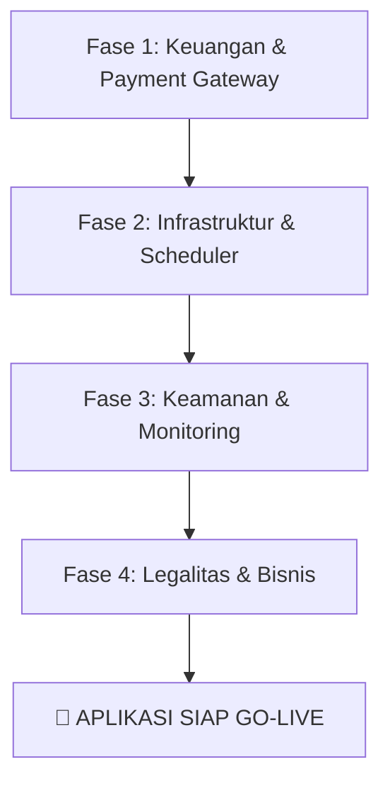

# 🚀 ISP-FinTrack Go-Live & Production Readiness Checklist

Dokumen ini disusun sebagai panduan strategis dan teknis sebelum meluncurkan aplikasi **ISP-FinTrack** ke pengguna akhir (Go-Live) atau menjualnya secara komersial (B2B SaaS).

Analisis ini didasarkan pada status proyek saat ini yang telah mencapai beberapa pencapaian kunci:
*   **Database:** Migrasi ke Neon Tech (Serverless PostgreSQL) selesai.
*   **Deployment:** Terpasang di Vercel.
*   **Quality Assurance:** Testcase fungsional/otomatis telah disiapkan.
*   **Data Integrity:** Normalisasi tipe data `amount` (menjadi `int`/`numeric`) dan data `time` (`timestamp`/`timestamptz`) telah selesai.
*   **Timezone:** Konsisten menggunakan WIB (`Asia/Jakarta`).
*   **UI/UX:** Responsivitas perangkat dioptimalkan, performa visual tinggi (Elite Tier).
*   **Security:** Penerapan Role-Based Access Control (RBAC) pada tiap peran pengguna.
*   **Payment Gateway:** Integrasi Midtrans Sandbox selesai.

Berikut adalah aspek-aspek krusial yang **wajib** dicapai sebelum aplikasi siap untuk Go-Live atau dijual.

---

## 🗺️ Ringkasan Roadmap Go-Live



---

## 1. 💳 Migrasi & Penyempurnaan Payment Gateway (Midtrans Production)

Integrasi Midtrans Sandbox saat ini sudah berfungsi, namun untuk beralih ke lingkungan produksi (*Production Environment*), langkah-langkah berikut harus dilakukan:

### 📑 1.1 Persyaratan Legal & Registrasi Akun
*   **Badan Usaha (Sangat Direkomendasikan):** Daftarkan akun Midtrans atas nama badan usaha (**CV** atau **PT**). Akun individu/perorangan memiliki batasan limit harian dan jenis metode pembayaran (misal: kartu kredit biasanya memerlukan badan hukum).
*   **Verifikasi Dokumen:** Siapkan dokumen legalitas (NPWP, NIB, KTP pengurus, Akta Pendirian, dan Rekening Bank Perusahaan) untuk diserahkan ke Midtrans. Proses verifikasi biasanya memakan waktu 3-5 hari kerja.

### 🔑 1.2 Konfigurasi Environment Variables
Saat beralih ke Production, ubah kredensial di `.env` (Vercel Dashboard) menggunakan Key Production dari Dashboard Midtrans:
```env
MIDTRANS_SERVER_KEY=pv-prod-xxxxxxxxxxxxxxxxx # Ganti dengan Production Server Key
MIDTRANS_CLIENT_KEY=pv-prod-xxxxxxxxxxxxxxxxx # Ganti dengan Production Client Key
MIDTRANS_IS_PRODUCTION=true                   # WAJIB diubah ke true
```

### 🪝 1.3 Pembaruan URL Webhook & Keamanan Signature
*   **Webhook URL:** Daftarkan URL produksi Anda pada dashboard Midtrans (Settings > Payment):
    `https://nama-domain-anda.com/api/midtrans/webhook`
*   **Event Handling Lebih Lengkap:** Kode saat ini di `src/app/api/midtrans/webhook/route.ts` hanya memproses status sukses (`capture` dan `settlement`). Untuk Go-Live, sistem wajib menangani status kegagalan/pending agar tagihan tidak menggantung selamanya di database:
    *   `pending`: Ubah status transaksi ke 'Pending' dan batasi akses fitur pembayaran ganda.
    *   `deny` / `cancel` / `expire`: Ubah status transaksi menjadi 'Failed' atau 'Expired', dan kembalikan invoice pelanggan ke status 'Unpaid' agar mereka bisa generate link baru.

---

## 2. ⚙️ Infrastruktur & Otomatisasi (Database & Cron Jobs)

Aplikasi Next.js di Vercel berjalan secara serverless. Hal ini mengubah cara kita mengelola tugas latar belakang (*background tasks*) dan koneksi database.

### ⏰ 2.1 Konfigurasi Vercel Cron untuk Materialized Views
Aplikasi Anda mengandalkan **Materialized Views** (`ar_aging_mv`, `dashboard_summary_mv`, dll.) untuk performa dashboard yang cepat. Di lingkungan lokal, Anda mungkin menggunakan `node-cron` di `instrumentation.ts`. 
*   **Masalah Serverless:** Pada Vercel, fungsi serverless akan "tidur" jika tidak ada request masuk. `node-cron` dalam memori **TIDAK AKAN JALAN** secara andal di Vercel.
*   **Solusi:** Gunakan **Vercel Cron** dengan membuat file `vercel.json` di root proyek:
    ```json
    {
      "crons": [
        {
          "path": "/api/cron",
          "schedule": "0 17 * * *" 
        }
      ]
    }
    ```
    *(Catatan: `0 17 * * *` UTC sama dengan jam `00:00` WIB).*
*   **Uji Timeout:** Pastikan `/api/cron` tidak melebihi batas waktu (timeout) eksekusi serverless Vercel (15 detik untuk Hobby tier, 300 detik untuk Pro tier). Karena me-refresh 5 materialized views sekaligus dapat memakan waktu lama, pastikan kueri SQL di Neon Tech terindeks dengan baik.

### 💾 2.2 Backup Database Otomatis & Skalabilitas Neon
*   **Neon Auto-backup:** Neon Tech menyediakan fitur *Point-in-Time Recovery* (PITR) dan backup harian otomatis secara gratis/berbayar. Pastikan durasi retensi backup diatur sesuai kebutuhan bisnis (minimal 7 hari terakhir).
*   **External Backup (Disaster Recovery):** Siapkan skrip terjadwal (misal via GitHub Actions) untuk mengekspor database secara berkala (`pg_dump`) ke penyimpanan cloud eksternal seperti AWS S3 atau Google Cloud Storage.
*   **Neon Autoscaling Limits:** Konfigurasikan batas atas *Compute Units* (CU) di Neon Tech agar database dapat menyesuaikan kapasitas secara otomatis saat terjadi lonjakan traffic, tetapi tetap memiliki limit pengeluaran bulanan agar biaya tidak membengkak tanpa kontrol.

---

## 📧 3. Migrasi Sistem Email (Transactional Email Provider)

Saat ini aplikasi menggunakan Gmail SMTP (`GMAIL_USER`, `GMAIL_APP_PASSWORD`) untuk mengirim email reset password dan notifikasi tagihan.

*   **Risiko Gmail SMTP:** Gmail membatasi pengiriman email maksimal 500 email per hari untuk akun personal. Selain itu, jika Gmail mendeteksi pengiriman email otomatis massal, akun Anda dapat diblokir permanen karena dianggap menyebarkan spam.
*   **Solusi Produksi:** Migrasikan sistem email ke penyedia email transaksional profesional seperti **Resend**, **SendGrid**, **Mailgun**, atau **Amazon SES**.
*   **Domain Authentication:** Konfigurasikan DNS domain Anda dengan menambahkan record **SPF, DKIM, dan DMARC** untuk memastikan email notifikasi tagihan/invoice masuk ke Inbox pelanggan, bukan ke folder Spam.

---

## 🛡️ 4. Keamanan Aplikasi & Pembatasan Akses (Security Hardening)

Karena aplikasi ini mengelola data finansial sensitif dan infrastruktur fisik ISP, keamanan adalah prioritas tertinggi.

### 🔒 4.1 SSL & Security Headers
*   **SSL/TLS:** Vercel secara otomatis menyediakan sertifikat SSL gratis (Let's Encrypt). Pastikan semua domain dan subdomain dipaksa menggunakan HTTPS (`Force HTTPS`).
*   **Security Headers:** Tambahkan konfigurasi header keamanan di `next.config.ts` untuk mencegah celah keamanan umum:
    ```typescript
    // Contoh Security Headers di next.config.ts
    const securityHeaders = [
      { key: 'X-DNS-Prefetch-Control', value: 'on' },
      { key: 'Strict-Transport-Security', value: 'max-age=63072000; includeSubDomains; preload' },
      { key: 'X-Frame-Options', value: 'SAMEORIGIN' },
      { key: 'X-Content-Type-Options', value: 'nosniff' },
      { key: 'Referrer-Policy', value: 'origin-when-cross-origin' },
      { key: 'Content-Security-Policy', value: "default-src 'self'; ..." } // Sesuaikan dengan kebutuhan Leaflet Map & Recharts
    ];
    ```

### 🚦 4.2 Rate Limiting (Mencegah DDoS & Brute-Force)
*   Batasi jumlah request pada endpoint sensitif seperti `/api/auth/login`, `/api/auth/reset-password`, dan `/api/midtrans/webhook`.
*   Gunakan library middleware rate limiter berbasis memory cache cepat seperti **Upstash Redis** (sangat cocok untuk serverless) atau Vercel KV untuk memblokir IP yang melakukan request berlebihan.

---

## 📊 5. Monitoring, Logging, & Pelacakan Error

Di lingkungan produksi, Anda tidak bisa lagi memantau error menggunakan terminal `console.log`. Anda memerlukan sistem pemantauan yang proaktif.

*   **Error Tracking (Sentry / GlitchTip):** Integrasikan **Sentry** ke proyek Next.js Anda. Sentry akan secara otomatis menangkap error runtime di sisi klien (browser) maupun server, lengkap dengan *stack trace* dan baris kode yang rusak.
*   **Log Aggregator (Axiom / BetterStack Logtail):** Sambungkan log konsol Next.js/Vercel ke layanan log terpusat. Kode logger Anda di `src/lib/logger.ts` sudah siap memformat JSON di lingkungan produksi. Layanan seperti Axiom memudahkan pencarian histori log jika terjadi masalah pembayaran atau kegagalan sinkronisasi database.
*   **Uptime Monitoring:** Gunakan layanan seperti UptimeRobot atau BetterStack Uptime untuk memantau apakah aplikasi web atau endpoint API Anda mati, dan mengirimkan notifikasi instan ke WhatsApp/Telegram/Slack tim Anda.

---

## ⚖️ 6. Aspek Hukum, Legalitas & Kepatuhan (Compliance)

Menjual software ERP finansial ke ISP lain mengharuskan Anda mematuhi regulasi hukum di Indonesia.

*   **Kebijakan Privasi (Privacy Policy):** Berdasarkan **UU Pelindungan Data Pribadi (UU PDP)** di Indonesia, Anda wajib menyediakan dokumen Kebijakan Privasi yang menjelaskan bagaimana data pelanggan ISP (nama, koordinat GPS rumah, nomor telepon, histori pembayaran) dikumpulkan, disimpan, dan diamankan.
*   **Syarat dan Ketentuan (Terms of Service):** Tulis kontrak layanan yang jelas untuk membatasi tanggung jawab hukum Anda jika terjadi kehilangan data akibat kegagalan server pihak ketiga (misal Neon DB atau Vercel mati).
*   **SLA (Service Level Agreement):** Jika menjual aplikasi ini sebagai SaaS B2B bulanan, tentukan batas jaminan ketersediaan sistem (misal: 99.9% uptime) beserta skema ganti rugi jika sistem tidak dapat diakses di masa penagihan krusial.

---

## 🏢 7. Pilihan Model Bisnis & Arsitektur SaaS (Multi-Tenant)

Bagaimana cara Anda menjual aplikasi ini? Keputusan ini memengaruhi arsitektur database Anda:

### 🏛️ Opsi A: Dedicated Single-Tenant (Paling Mudah)
*   **Cara Kerja:** Setiap ISP yang membeli aplikasi akan mendapatkan instance tersendiri (satu akun Vercel terpisah + satu database Neon terpisah + satu domain khusus seperti `billing.ispname.com`).
*   **Kelebihan:** Isolasi data 100% aman antar ISP, kustomisasi fitur per ISP sangat mudah dilakukan.
*   **Kekurangan:** Biaya operasional tinggi dan sulit untuk melakukan pembaruan kode secara massal (harus deploy manual ke puluhan server berbeda).

### 🌐 Opsi B: Multi-Tenant SaaS (Skala Besar)
*   **Cara Kerja:** Satu codebase dan satu database besar yang melayani banyak ISP sekaligus. Data dipisahkan secara logis menggunakan kolom `tenant_id` di setiap tabel.
*   **Kelebihan:** Efisiensi biaya tinggi, satu kali pembaruan kode akan langsung dinikmati semua pelanggan.
*   **Kekurangan:** Memerlukan refactoring database yang cukup besar pada query SQL untuk memastikan tidak ada kebocoran data antar ISP (data ISP A tidak boleh terlihat oleh ISP B).

---

## 📋 Checklist Kesiapan Go-Live (Ringkas)

Silakan centang item berikut setelah Anda menyelesaikannya:

- [Ini dilakukan jika sudah ada client yang pakai project ini] **Pembayaran (Midtrans):** Daftarkan akun badan hukum (PT/CV) dan aktifkan metode VA, E-Wallet, dll.
- [Pindah ke Environment Productions jika sudah ada client yang pakai project ini] **Pembayaran (Midtrans):** Ubah variabel lingkungan ke server key & client key produksi.
- [x] **Otomatisasi:** Pindahkan `node-cron` lokal ke Vercel Cron atau scheduler eksternal. *(Selesai: Diimplementasikan via `/api/cron` dan `vercel.json` untuk refresh Materialized Views & log cleanup).*
- [ ] **Infrastruktur:** Buat cadangan database Neon harian ke AWS S3 / Google Cloud Storage.
- [Karena email hanya digunakan ketika forgot password, jadi tidak perlu pakai SMTP] **Email:** Ganti Gmail SMTP dengan penyedia email transaksional (Resend, SendGrid, SES).
- [Karena email hanya digunakan ketika forgot password, jadi tidak perlu pakai] **Email:** Konfigurasikan SPF, DKIM, dan DMARC pada domain kustom Anda.
- [x] **Keamanan:** Tambahkan HTTP Security Headers pada `next.config.ts`. *(Selesai: Header keamanan lengkap seperti CSP, HSTS, X-Frame-Options, dll. sudah aktif).*
- [x] **Keamanan:** Pasang rate-limiter untuk endpoint Auth & Payment. *(Selesai: Database-backed rate limiter aktif di `loginAction`, `createPaymentLink`, dan webhook endpoint).*
- [kita pakai yang gratis, dan sudah tersedia di /settings/logs] **Pemantauan:** Hubungkan Sentry untuk pelacakan error runtime.
- [x] **Pemantauan:** Pasang Uptime monitoring untuk memantau status server. *(Selesai: Telah dibuatkan endpoint `/api/health` yang mengecek status koneksi database. Anda bisa mendaftarkan URL ini di UptimeRobot.com secara gratis).*
- [x] **Hukum:** Tulis dokumen Kebijakan Privasi (UU PDP) dan Syarat & Ketentuan. *(Selesai: Halaman `/privacy-policy` dan `/terms-of-service` telah dibuat dan ditambahkan link-nya di halaman Login serta Sidebar).*
- [x] **CI/CD:** Buat alur GitHub Actions untuk menjalankan `npm run test:run` dan linting sebelum proses build vercel dimulai. *(Selesai: Script CI/CD telah dibuat di `.github/workflows/ci.yml`).*

---

## 🆕 Pembaruan & Perbaikan Codebase Terbaru (Mei 2026)

Berikut adalah daftar perbaikan dan optimasi fitur terbaru yang telah sukses diimplementasikan ke dalam kode aplikasi:

### 📱 1. Optimasi UI/UX & Responsive Layout (Mobile & Tablet)
*   **Sistem Expandable Logs (`src/app/settings/logs/page.tsx`):**
    *   Tabel log pada perangkat smartphone diubah menjadi format kartu accordion interaktif yang dapat di-expand/collapse guna menghilangkan scroll horizontal.
    *   Ditambahkan tombol **Copy** pada bagian *Error Stack Trace* untuk mempermudah penyalinan jejak error ke clipboard.
*   **Pagination Responsif & Presisi:**
    *   **Smartphone Terkecil:** Dibatasi hanya menampilkan 3 angka halaman + elipsis (`...`), menjaga tombol *Previous* & *Next* tetap satu baris tanpa melebihi batas kontainer.
    *   **Smartphone Terbesar & Tablet Portrait:** Mengembalikan layout pagination ke format satu baris normal (menampilkan 5 angka halaman secara horizontal) dengan mengunci breakpoint CSS.

### 🔒 2. Manajemen Password & Integrasi Database (`src/app/profile/page.tsx`)
*   **Keamanan Database Neon Tech:**
    *   Menambahkan kolom `last_password_change` berjenis `timestamptz` di tabel `admin` untuk merekam waktu presisi pergantian password.
    *   Menyesuaikan `changePasswordAction` dan `resetPassword` di `src/actions/auth.ts` untuk memperbarui timestamp ini ke Neon DB.
*   **Penyempurnaan Form Profile:**
    *   Menghapus pembatasan minimal 6 karakter pada frontend karena password yang dikirim akan otomatis di-hash via bcrypt di server.
    *   Menambahkan trigger pembersihan (*clear*) input form secara otomatis saat modal ganti password ditutup atau tombol batal (x) diklik.
    *   Menampilkan status "Last changed: X time ago" yang ter-update secara real-time menggunakan invalidasi cache `queryClient.invalidateQueries`.

### 🎫 3. ebar (`src/app/tickets/`)
*   **Optimalisasi Responsivitas Kanban Board (`src/components/tickets/TicketsKanban.tsx`):**
    *   Mengatur agar kolom Kanban (seperti *Open*, *Progress*, *Resolved*, *Closed*) pada layar smartphone (terkecil & terbesar) serta tablet portrait dapat di-expand/collapse secara vertikal dengan transisi `framer-motion` yang halus. Hal ini meniadakan kebutuhan scroll horizontal di layar sempit.
    *   Penyelarasan palet warna prioritas dan status tiket pada mode gelap agar kontras lebih harmonis dan nyaman dibaca.
*   **Halaman Khusus Histori Tiket (`src/app/tickets/history/page.tsx` & `src/components/tickets/TicketsHistoryClient.tsx`):**
    *   Mengganti modal "Resolved History" yang sebelumnya memakan layar penuh (intrusif) dengan dedicated page `/tickets/history`.
    *   Membuat tabel log data-grid responsif yang otomatis berubah menjadi bentuk list kartu accordion interaktif pada layar mobile.
    *   Dilengkapi tombol toggle expand/collapse dan pencarian real-time (by ticket number, customer, description) untuk kenyamanan pencarian.
    *   Menghilangkan border divider bawaan (`divide-y`) pada device mobile dan menambahkan vertical gap (`gap-4`) antar kartu untuk menghindari layout yang terlalu padat dan menumpuk ke bawah.
